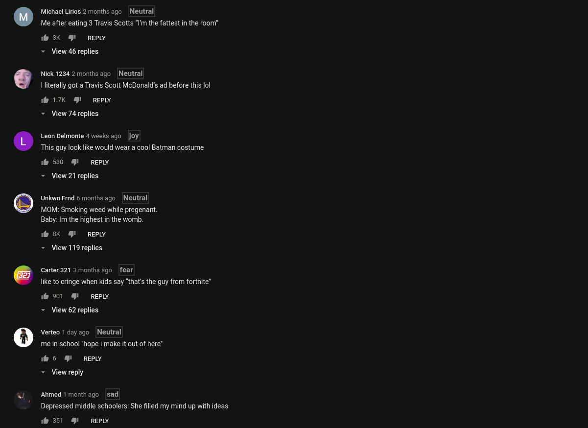

## Installation

-   Go to [chrome://extensions](chrome://extensions) - Chrome Extensions
-   Turn on developer mode from the upper right corner
-   Load Unpacked and select yt-comment-analyser


Open your terminal:

```
cd semantic-analysis/
npm install
node app.js
```



Open for collaborations. Please feel free to append the algorithm for analyser and add some new features.

Don't forget to leave a ⭐ if you found this useful.
